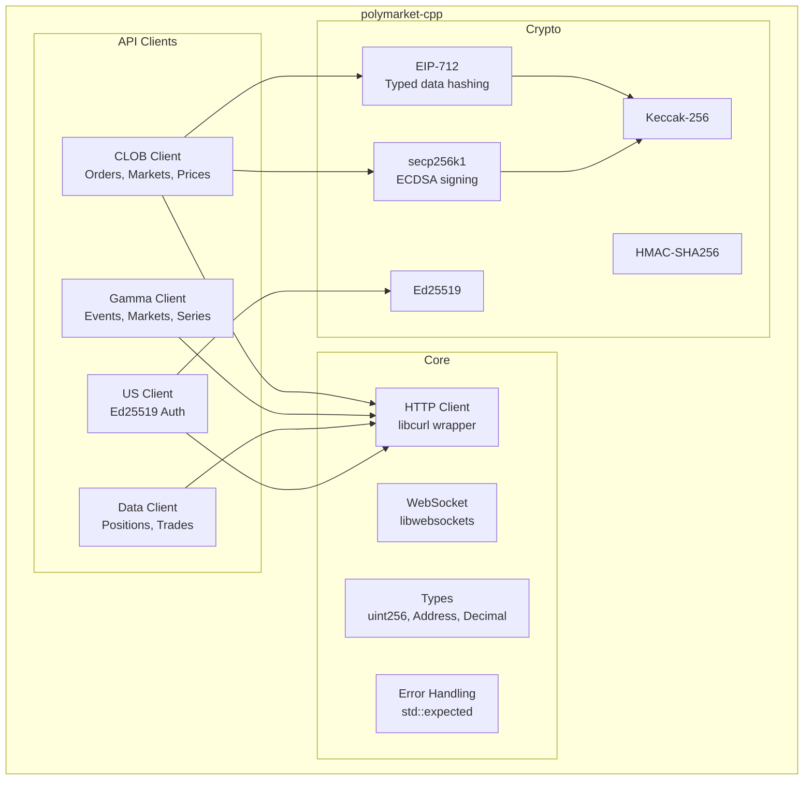
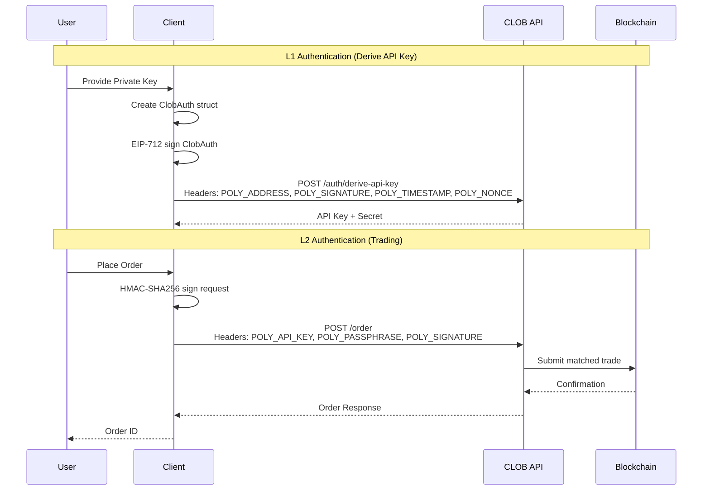

# polymarket-cpp

A production-grade C++ SDK for [Polymarket](https://polymarket.com) prediction market APIs.

[](https://github.com/Reddimus/polymarket-cpp/actions/workflows/ci.yml)
[](https://github.com/Reddimus/polymarket-cpp/releases)
[](https://en.cppreference.com/w/cpp/20)
[](https://opensource.org/licenses/MIT)

> [!WARNING]
> **CLOB V1 deprecated 2026-04-28.** Polymarket upgraded `clob.polymarket.com`
> to V2 on 2026-04-28 and declared V1 "no longer supported". The order
> struct, EIP-712 domain version (1 → 2), and collateral token
> (USDC.e → pUSD) all changed. The `polymarket::clob::*` modules in this
> SDK still emit V1-shaped orders and **will fail against live V2
> endpoints**. Use `polymarket::us::Client` (CFTC-regulated Polymarket US)
> for live trading until a V2 migration lands. See
> [the CHANGELOG](CHANGELOG.md) for details.

## Features

- **Full CLOB API Coverage** (V1 — deprecated upstream, see warning above): Orders, markets, prices, order books, and more
- **Polymarket US (CFTC-regulated)**: Ed25519-signed access to `api.polymarket.us`, production-ready
- **Type-Safe Order Builders**: Compile-time validation for limit and market orders
- **EIP-712 Signing**: Complete cryptographic support for Ethereum-compatible signatures
- **Modern C++23**: Uses `std::expected`, `std::span`, and other modern features
- **CMake Integration**: Easy to integrate via FetchContent or find_package
- **Comprehensive Testing**: Unit tests for all crypto and core functionality

## Architecture



## Quick Start

### Prerequisites

- C++23 compatible compiler (GCC 13+, Clang 17+, MSVC 2022)
- CMake 3.20+
- OpenSSL 3.x
- libcurl

### Building

```bash
# Clone the repository
git clone https://github.com/Reddimus/polymarket-cpp.git
cd polymarket-cpp

# Build
make build

# Run tests
make test
```

### Using with CMake FetchContent

```cmake
include(FetchContent)
FetchContent_Declare(
    polymarket_cpp
    GIT_REPOSITORY https://github.com/Reddimus/polymarket-cpp.git
    GIT_TAG v0.4.2  # pin a tagged release; see CHANGELOG.md
)
FetchContent_MakeAvailable(polymarket-cpp)

add_executable(my_bot main.cpp)
target_link_libraries(my_bot PRIVATE polymarket::clob)
```

### Using with find_package

```cmake
find_package(polymarket-cpp REQUIRED)
target_link_libraries(my_bot PRIVATE polymarket::clob)
```

## Usage Examples

### Polymarket US (Ed25519, CFTC-regulated) — recommended for live trading

```cpp
#include <polymarket/us/client.hpp>
#include <iostream>

int main() {
    using namespace polymarket;

    us::Client client;
    // Secret is base64 of 64 bytes (seed||pub) per docs.polymarket.us;
    // set_credentials() validates the length and slices [:32] for Ed25519.
    auto rc = client.set_credentials({
        .key_id = std::getenv("PM_US_KEY_ID"),
        .secret_key = std::getenv("PM_US_SECRET"),
    });
    if (!rc) return 1;

    // Public host (gateway.polymarket.us) — no auth needed
    us::MarketFilter f;
    f.tag_id = 38;  // weather
    f.active = true;
    f.limit = 10;
    auto markets = client.get_markets(f);

    // Authed host (api.polymarket.us) — Ed25519 headers added by the SDK
    auto balance = client.get_balance();
    auto positions = client.get_positions();

    std::cout << "balance: " << balance.value_or("error") << '\n';
    return 0;
}
```

For an end-to-end smoke test (5 endpoints, <1s) see
[`examples/us_smoke.cpp`](examples/us_smoke.cpp) — run with
`make run-us_smoke` after exporting `PM_US_KEY_ID` and
`PM_US_SECRET_FILE`.

### Fetch Market Data via CLOB (V1 — deprecated upstream 2026-04-28)

> [!WARNING]
> The CLOB V1 client below targets `clob.polymarket.com`, which Polymarket
> upgraded to V2 on 2026-04-28. V1 reads may still respond briefly during
> the transition but cannot be relied on. Prefer the Polymarket US example
> above for new code.

```cpp
#include <polymarket/clob/client.hpp>
#include <iostream>

int main() {
    using namespace polymarket::clob;
    
    // Create unauthenticated client
    auto client = Client::create("https://clob.polymarket.com");
    
    // Get server time
    auto time_result = client.get_server_time();
    if (time_result) {
        std::cout << "Server time: " << *time_result << std::endl;
    }
    
    // Get markets
    MarketsRequest req;
    req.next_cursor = std::nullopt;
    
    auto markets = client.get_markets(req);
    if (markets) {
        for (const auto& market : markets->data) {
            std::cout << "Market: " << market.question << std::endl;
        }
    }
    
    return 0;
}
```

### Place Orders via CLOB (V1 — deprecated upstream 2026-04-28)

> [!WARNING]
> Live order placement against `clob.polymarket.com` will fail under V2.
> The example below is kept for historical reference and for V2 migrators
> who want to compare wire shapes. Use `polymarket::us::Client` for live
> trading.

```cpp
#include <polymarket/clob/client.hpp>
#include <polymarket/crypto/secp256k1.hpp>

int main() {
    using namespace polymarket;
    using namespace polymarket::clob;
    using namespace polymarket::crypto;
    
    // Load private key
    auto key = PrivateKey::from_hex("0x...");
    if (!key) {
        std::cerr << "Failed to load key" << std::endl;
        return 1;
    }
    
    auto address = key->address();
    if (!address) {
        return 1;
    }
    
    // Create authenticated client
    ClientConfig config;
    config.base_url = "https://clob.polymarket.com";
    config.chain_id = 137;  // Polygon mainnet
    
    auto client = Client::create(config);
    client.set_signer(*address);
    
    // Build and sign a limit order
    auto builder = client.limit_order_builder();
    builder.token_id(uint256_t::from_string("12345"));
    builder.side(Side::Buy);
    builder.price(Decimal("0.50"));
    builder.size(Decimal("100"));
    
    auto order = builder.build();
    if (!order) {
        std::cerr << "Order validation failed: " << order.error().message() << std::endl;
        return 1;
    }
    
    // Sign the order
    auto signed_order = client.sign_order(*order, *key);
    if (!signed_order) {
        return 1;
    }
    
    // Place the order
    auto result = client.post_order(*signed_order);
    if (result) {
        std::cout << "Order placed: " << result->id << std::endl;
    }
    
    return 0;
}
```

## Authentication Flow (CLOB V1 — deprecated upstream 2026-04-28)

> [!WARNING]
> The L1/L2 auth flow below applies to **CLOB V1 only**. Polymarket's
> 2026-04-28 V2 cutover replaced this signing flow (EIP-712 domain
> version bumped 1 → 2, taker/feeRateBps removed from the order
> struct). For live Polymarket US trading, see the Ed25519-based
> `polymarket::us::Client` example above — no derive-API-key step,
> single HMAC-free header set, simpler all around.



## Order Builder Flow (CLOB V1 — deprecated upstream 2026-04-28)

> [!WARNING]
> The order builder + EIP-712 sign + POST flow below targets CLOB V1.
> V2 deprecated this flow on 2026-04-28; see the
> [Polymarket changelog](https://docs.polymarket.com/changelog) for the
> new order struct (timestamp / metadata / builder fields, removed
> nonce / feeRateBps / taker). The diagram is kept for V1 historical
> reference and as a reference shape for anyone porting to V2.


## API Coverage

| API | Endpoint | Status |
|-----|----------|--------|
| **CLOB** | Health, Time | ✅ |
| | Markets | ✅ |
| | Order Book | ✅ |
| | Prices | ✅ |
| | Orders (CRUD) | ✅ |
| | Trades | ✅ |
| | Balance/Allowance | ✅ |
| | API Key Management | ✅ |
| | WebSocket (market + user channels) | ✅ |
| **Gamma** | Events | ⏳ Stub |
| | Markets | ⏳ Stub |
| | Series | ⏳ Stub |
| **Data** | Positions | ⏳ Stub |
| | Trades | ⏳ Stub |
| **US (v0.1.0)** | Health, Tags, Markets, Orderbook, Settlement, Candles | ✅ |
| | Account Balance, Positions, Activities | ✅ |
| | Orders (single + batched + cancel + modify) | ✅ |
| | WebSocket subscriber | ✅ |

US order placement accepts short aliases or docs enums for
`time_in_force`. Omitted values remain
`TIME_IN_FORCE_GOOD_TILL_CANCEL`; live weather traders should set
`time_in_force="ioc"` for entry orders so stale quotes do not rest as
open GTC exposure. Optional `client_order_id` and
`manual_order_indicator` fields are passed through when supplied.

## Directory Structure

```
polymarket-cpp/
├── CMakeLists.txt          # Root build configuration
├── Makefile                # Convenience targets
├── include/
│   └── polymarket/
│       ├── polymarket.hpp  # Umbrella header
│       ├── core/           # Error, types, utilities
│       ├── crypto/         # Keccak, secp256k1, EIP-712
│       ├── clob/           # CLOB API client
│       ├── gamma/          # Gamma API client
│       ├── data/           # Data API client
│       └── us/             # Polymarket US client
├── src/                    # Implementation files
├── tests/                  # Unit and integration tests
├── examples/               # Usage examples
└── docs/                   # Additional documentation
```

## Configuration Options

| Option | Default | Description |
|--------|---------|-------------|
| `POLYMARKET_BUILD_TESTS` | ON | Build unit tests |
| `POLYMARKET_BUILD_EXAMPLES` | ON | Build examples |
| `POLYMARKET_USE_CPP26` | OFF | Enable C++26 features (experimental) |

## Error Handling

The library uses `std::expected<T, Error>` for error handling:

```cpp
auto result = client.get_order_book(token_id);
if (result) {
    // Success: use *result
    for (const auto& bid : result->bids) {
        std::cout << bid.price << " x " << bid.size << std::endl;
    }
} else {
    // Error: check result.error()
    switch (result.error().code()) {
        case ErrorCode::NetworkError:
            std::cerr << "Network error: " << result.error().message() << std::endl;
            break;
        case ErrorCode::AuthError:
            std::cerr << "Authentication failed" << std::endl;
            break;
        default:
            std::cerr << "Error: " << result.error().message() << std::endl;
    }
}
```

## Contributing

Contributions are welcome! Please see [CONTRIBUTING.md](docs/CONTRIBUTING.md) for guidelines.

## License

This project is licensed under the MIT License - see the [LICENSE](LICENSE) file for details.

## Disclaimer

This is an unofficial, third-party SDK. It is not affiliated with, endorsed by, or sponsored by Polymarket. Use at your own risk. Trading on prediction markets involves financial risk.

## See Also

- [Polymarket Documentation](https://docs.polymarket.com)
- [Official Python SDK](https://github.com/Polymarket/py-clob-client)
- [Official TypeScript SDK](https://github.com/Polymarket/clob-client)
- [kalshi-cpp](https://github.com/Reddimus/kalshi-cpp) - Similar C++ SDK for Kalshi
