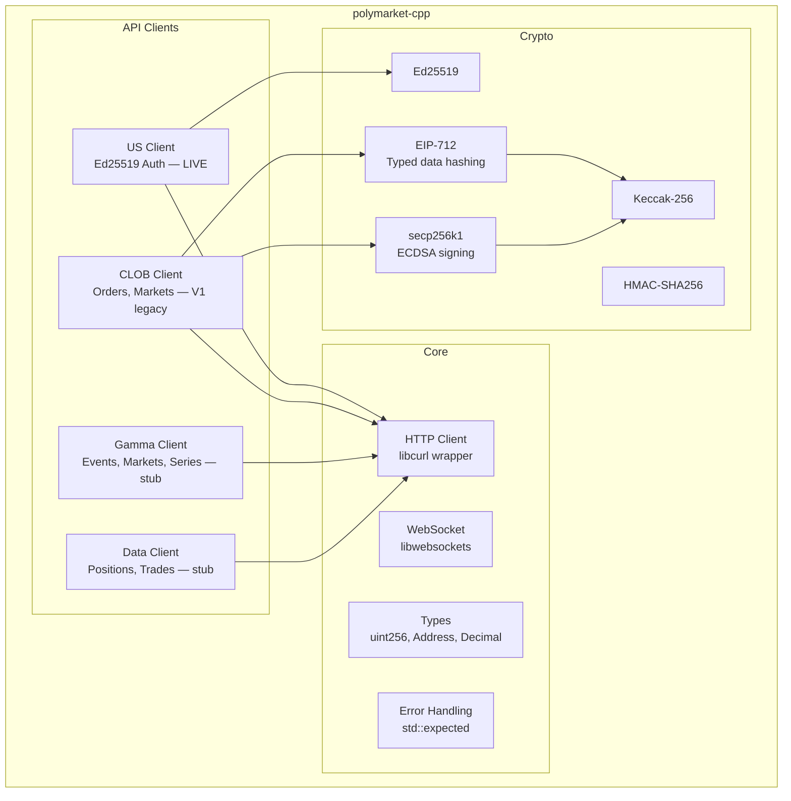
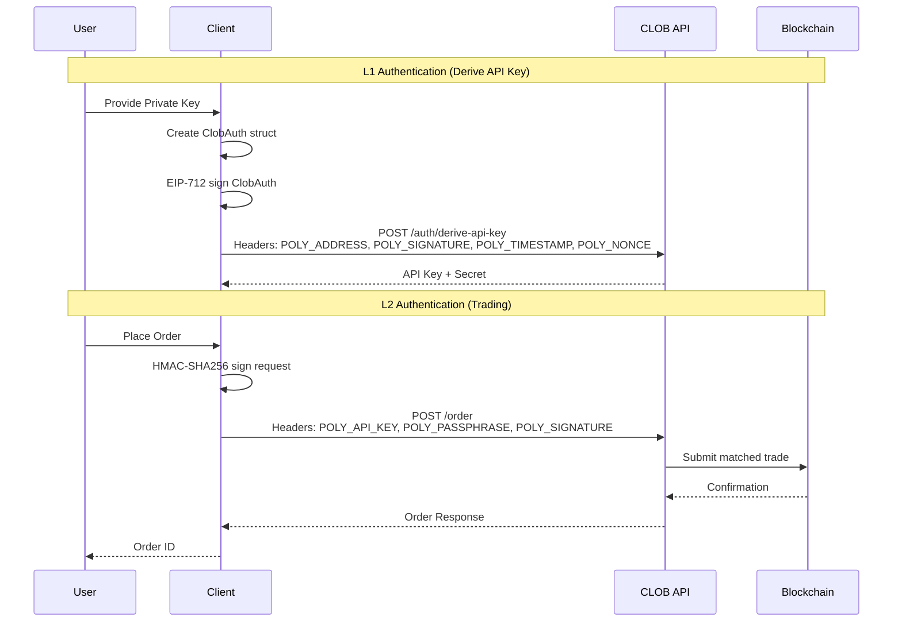

# polymarket-cpp

A production-grade, modern **C++23 SDK for [Polymarket](https://polymarket.com)** prediction markets — trading and market data.

[](https://github.com/Reddimus/polymarket-cpp/actions/workflows/ci.yml)
[](https://github.com/Reddimus/polymarket-cpp/releases)
[](https://en.cppreference.com/w/cpp/23)
[](https://opensource.org/licenses/MIT)

polymarket-cpp exposes **two surfaces**:

- **Polymarket US** (`polymarket::us::Client`) — the CFTC-regulated US event-trading
  platform. Ed25519-signed access to `api.polymarket.us` (authed) and
  `gateway.polymarket.us` (public). **This is the live, recommended path for trading**
  and the path used in production by [PredictionCastAI](https://github.com/Reddimus).
- **CLOB** (`polymarket::clob::Client`) — the offshore order book API (EIP-712 / secp256k1
  signing). **CLOB V1 was deprecated upstream on 2026-04-28** (Polymarket cut
  `clob.polymarket.com` over to V2). The V1 modules in this SDK are kept for reference
  and migration only — see [Legacy: CLOB V1](#legacy-clob-v1-deprecated-2026-04-28).

It ships type-safe order builders, in-tree EIP-712 / secp256k1 and Ed25519 signing,
`std::expected`-based error handling, and first-class CMake / FetchContent integration.

> [!TIP]
> **New here?** Use the **Polymarket US** client — start at [Quick start](#quick-start).
> The CLOB V1 client is deprecated upstream; only reach for it if you are migrating
> existing V1 code.

## Features

- **Polymarket US (CFTC-regulated)** — Ed25519-signed access to `api.polymarket.us`; the
  recommended live-trading path. Markets, order books, settlement, candles, balances,
  positions, activities, single/batched orders, cancel/modify, and a WebSocket subscriber.
- **Modern C++23** — `std::expected`, `std::span`, designated initializers, and other
  modern features throughout.
- **`std::expected` error handling** — no exceptions on the hot path; every call returns
  `Result<T>` (= `std::expected<T, Error>`).
- **CMake integration** — drop in via FetchContent or `find_package` (exports
  `polymarketConfig.cmake`).
- **60+ Catch2 unit tests** — covering crypto, core, the CLOB client, and the US client.
- **Legacy CLOB client** (V1 wire format — deprecated upstream 2026-04-28; see
  [Legacy: CLOB V1](#legacy-clob-v1-deprecated-2026-04-28)): order builders, EIP-712
  signing, markets, prices, order books, and WebSocket. Retained for reference / V2
  migrators.

## Architecture



## Quick start

The fastest way to consume polymarket-cpp is **CMake FetchContent** with a pinned tag —
this is how downstream services (e.g. `polymarket-trader`, which pins `v0.4.3`) integrate it.

### 1. Prerequisites

- **C++23 compiler** — GCC 13+, Clang 17+, or MSVC 2022
- **CMake 3.20+**
- **OpenSSL 3.x**, **libcurl**, **libwebsockets**, **pkg-config**

`secp256k1`, `Glaze`, and `Catch2` are fetched automatically at configure time via
FetchContent — no system install needed.

Install the system dependencies:

```bash
# Debian / Ubuntu (use g++-13 if your default GCC is older than 13)
sudo apt install build-essential cmake pkg-config \
    libssl-dev libcurl4-openssl-dev libwebsockets-dev
```

```bash
# macOS (Homebrew)
brew install cmake openssl@3 curl libwebsockets pkg-config
export OPENSSL_ROOT_DIR="$(brew --prefix openssl@3)"
```

On **Windows**, supply `libwebsockets` via vcpkg config-mode (the CMake already expects
`find_package(libwebsockets CONFIG REQUIRED)`).

### 2. Add it to your CMake project

```cmake
include(FetchContent)
FetchContent_Declare(
    polymarket_cpp
    GIT_REPOSITORY https://github.com/Reddimus/polymarket-cpp.git
    GIT_TAG v0.4.3  # pin a tagged release; see CHANGELOG.md
)

# Keep your build lean: skip the SDK's own tests/examples/apps (and the
# Catch2 fetch they pull in).
set(POLYMARKET_BUILD_TESTS OFF CACHE BOOL "" FORCE)
set(POLYMARKET_BUILD_EXAMPLES OFF CACHE BOOL "" FORCE)
set(POLYMARKET_BUILD_APPS OFF CACHE BOOL "" FORCE)

FetchContent_MakeAvailable(polymarket_cpp)

add_executable(my_bot main.cpp)
# polymarket::us = live CFTC-regulated path. (polymarket::clob is the
# deprecated V1 surface — see the Legacy section.)
target_link_libraries(my_bot PRIVATE polymarket::us)
```

### 3. Set credentials

Copy [`.env.example`](.env.example) to `.env` and fill in your Polymarket US
credentials, then export them (or `source .env`). The US client needs a key id and a
base64 secret:

```bash
export PM_US_KEY_ID="your-api-key-id"
# The secret is the base64 of 64 bytes (seed||pub) from docs.polymarket.us.
# Pass it via a file path so it never has to live inline in your shell history.
export PM_US_SECRET_FILE="/path/to/base64-secret"
```

> [!WARNING]
> Never commit `.env` or your secret file. Trading credentials grant access to a real,
> regulated trading account.

### 4. Minimal US-client example (read-only)

```cpp
#include <polymarket/us/client.hpp>
#include <iostream>

int main() {
    using namespace polymarket;

    us::Client client;
    // Secret is base64 of 64 bytes (seed||pub) per docs.polymarket.us;
    // set_credentials() validates the length and slices [:32] for Ed25519.
    // Returns Result<void> (= std::expected<void, Error>).
    auto rc = client.set_credentials({
        .key_id = std::getenv("PM_US_KEY_ID"),
        .secret_key = std::getenv("PM_US_SECRET"),  // inline secret; see note below
    });
    if (!rc) {
        std::cerr << "auth setup failed: " << rc.error().message() << '\n';
        return 1;
    }

    // Public host (gateway.polymarket.us) — no auth needed.
    us::MarketFilter f;
    f.tag_id = 38;  // weather
    f.active = true;
    f.limit = 10;
    auto markets = client.get_markets(f);

    // Authed host (api.polymarket.us) — Ed25519 headers added by the SDK.
    auto balance = client.get_balance();
    auto positions = client.get_positions();

    std::cout << "balance: " << balance.value_or("error") << '\n';
    return 0;
}
```

> [!NOTE]
> For brevity the snippet above reads the secret inline from `PM_US_SECRET`. The shipped
> smoke test instead reads `PM_US_SECRET_FILE` (a file path) and loads the secret from
> disk — prefer that in real deployments to keep the secret off your shell history and
> process args.

For an end-to-end smoke test (5 endpoints, <1s) see
[`examples/us_smoke.cpp`](examples/us_smoke.cpp). Once `PM_US_KEY_ID` and
`PM_US_SECRET_FILE` are exported, the fastest auth/connectivity check is:

```bash
make run-us_smoke
```

## API Coverage

| API | Endpoint | Status |
|-----|----------|--------|
| **US** (live) | Health, Tags, Markets, Orderbook, Settlement, Candles | ✅ |
| | Account Balance, Positions, Activities | ✅ |
| | Orders (single + batched + cancel + modify) | ✅ |
| | WebSocket subscriber | ✅ |
| **CLOB** (V1 — deprecated, see Legacy) | Health, Time | ✅ |
| | Markets | ✅ |
| | Order Book | ✅ |
| | Prices | ✅ |
| | Orders (CRUD) | ✅ |
| | Trades | ✅ |
| | Balance/Allowance | ✅ |
| | API Key Management | ✅ |
| | WebSocket (market + user channels) | ✅ |
| **Gamma** | Events | ⏳ Stub |
| | Markets | ⏳ Stub |
| | Series | ⏳ Stub |
| **Data** | Positions | ⏳ Stub |
| | Trades | ⏳ Stub |

US order placement accepts short aliases or docs enums for `time_in_force`. Omitted
values remain `TIME_IN_FORCE_GOOD_TILL_CANCEL`; live weather traders should set
`time_in_force="ioc"` for entry orders so stale quotes do not rest as open GTC exposure.
Optional `client_order_id` and `manual_order_indicator` fields are passed through when
supplied.

## Configuration Options

These CMake options control the SDK build. Consumers embedding via FetchContent
typically set `POLYMARKET_BUILD_TESTS`, `POLYMARKET_BUILD_EXAMPLES`, and
`POLYMARKET_BUILD_APPS` to `OFF` (see [Quick start](#2-add-it-to-your-cmake-project))
to keep their tree lean and avoid the transitive Catch2 fetch.

| Option | Default | Description |
|--------|---------|-------------|
| `POLYMARKET_BUILD_TESTS` | ON | Build unit tests (pulls in Catch2) |
| `POLYMARKET_BUILD_EXAMPLES` | ON | Build the `examples/` binaries |
| `POLYMARKET_BUILD_APPS` | ON | Build production CLI binaries in `apps/` |
| `POLYMARKET_ENABLE_LTO` | ON | Link-time optimization for Release builds |
| `POLYMARKET_NATIVE_ARCH` | OFF | Use `-march=native` for CPU-specific tuning |
| `POLYMARKET_USE_CPP26` | OFF | Enable C++26 features (experimental) |

## Error Handling

The library uses `std::expected<T, Error>` — exposed as the aliases `Result<T>` and
`VoidResult` (for void-returning calls) in `polymarket/core/error.hpp`:

```cpp
auto result = client.get_order_book(token_id);
if (result) {
    // Success: use *result
    for (const auto& bid : result->bids) {
        std::cout << bid.price << " x " << bid.size << std::endl;
    }
} else {
    // Error: check result.error()
    switch (result.error().code()) {
        case ErrorCode::NetworkError:
            std::cerr << "Network error: " << result.error().message() << std::endl;
            break;
        case ErrorCode::AuthError:
            std::cerr << "Authentication failed" << std::endl;
            break;
        default:
            std::cerr << "Error: " << result.error().message() << std::endl;
    }
}
```

## Versioning & staying up to date

- **Semantic Versioning, pre-1.0 caveat.** polymarket-cpp follows
  [Semantic Versioning](https://semver.org/spec/v2.0.0.html). While pre-1.0 (`0.x`) the
  public API is **not yet stable**: a `0.MINOR` bump may contain breaking changes, while
  `0.x.PATCH` bumps are backward-compatible fixes. **Always pin an exact tag** — do not
  track a moving branch.
- **Changelog.** Every release is recorded in [CHANGELOG.md](CHANGELOG.md)
  ([Keep a Changelog](https://keepachangelog.com/en/1.1.0/) format). Read it before
  bumping your pin.
- **Bumping your pin.** Update `GIT_TAG` in your FetchContent block to the
  [latest release](https://github.com/Reddimus/polymarket-cpp/releases):

  ```cmake
  FetchContent_Declare(
      polymarket_cpp
      GIT_REPOSITORY https://github.com/Reddimus/polymarket-cpp.git
      GIT_TAG v0.4.3  # current release
  )
  ```

- **Single source of truth.** The version is defined once in `CMakeLists.txt`
  (`project(polymarket-cpp VERSION x.y.z ...)`). Each GitHub Release tag matches that
  value, and CMake exports `polymarketConfigVersion.cmake` with `SameMajorVersion`
  compatibility — so a `find_package` consumer can request, e.g.,
  `find_package(polymarket-cpp 0.4 REQUIRED)`.

## Building from source / development

You only need this if you are hacking on the SDK itself; consumers should use
[FetchContent](#quick-start) instead.

```bash
git clone https://github.com/Reddimus/polymarket-cpp.git
cd polymarket-cpp

make build        # Release build (CMake + make); make debug for Debug
make test         # Run the Catch2 unit tests (ctest)
make lint         # clang-format --dry-run (markdown is linted in CI)
make format       # Format in place
```

`make build` is a Release build by default. The fastest end-to-end auth/connectivity
check is `make run-us_smoke` once `PM_US_KEY_ID` and `PM_US_SECRET_FILE` are exported
(see [Quick start](#3-set-credentials)).

### Using a system-installed build (`find_package`)

FetchContent is the primary path. If you instead install the SDK
(`cmake --install`, which exports `polymarketTargets` / `polymarketConfig.cmake`), a
consumer can locate it with `find_package`. Compatibility is `SameMajorVersion`, so
request a version:

```cmake
find_package(polymarket-cpp 0.4 REQUIRED)
target_link_libraries(my_bot PRIVATE polymarket::us)  # match the recommended live path
```

## Legacy: CLOB V1 (deprecated 2026-04-28)

> [!WARNING]
> **CLOB V1 was deprecated upstream on 2026-04-28.** Polymarket upgraded
> `clob.polymarket.com` to V2 (EIP-712 Exchange domain version 1 → 2, the order struct
> changed, collateral USDC.e → pUSD). The `polymarket::clob::*` modules in this SDK still
> emit V1-shaped orders and **will fail against live V2 endpoints**. Use
> `polymarket::us::Client` (above) for live trading. The examples below are retained for
> historical reference and as a wire-shape reference for a future V2 port — they are not a
> supported live path. Full flow detail lives in
> [docs/authentication.md](docs/authentication.md) and
> [docs/order-building.md](docs/order-building.md).

### Fetch market data via CLOB (V1)

```cpp
#include <polymarket/clob/client.hpp>
#include <iostream>

int main() {
    using namespace polymarket::clob;

    // Create an unauthenticated client (public endpoints only).
    ClientConfig cfg;
    cfg.base_url = "https://clob.polymarket.com";
    auto client = Client::create(cfg);
    if (!client) {
        return 1;
    }

    // Get server time.
    auto time_result = client->server_time();
    if (time_result) {
        std::cout << "Server time: " << time_result->timestamp << std::endl;
    }

    // Get the first page of markets.
    auto markets = client->markets(std::nullopt);
    if (markets) {
        for (const auto& market : markets->items) {
            std::cout << "Market: " << market.question << std::endl;
        }
    }

    return 0;
}
```

### Place orders via CLOB (V1)

```cpp
#include <polymarket/clob/client.hpp>
#include <polymarket/crypto/secp256k1.hpp>
#include <iostream>

int main() {
    using namespace polymarket;
    using namespace polymarket::clob;
    using namespace polymarket::crypto;

    // Load a private key.
    auto key = PrivateKey::from_hex("0x...");
    if (!key) {
        std::cerr << "Failed to load key" << std::endl;
        return 1;
    }

    // Create a client (authenticate derives an API key via L1 auth).
    ClientConfig config;
    config.base_url = "https://clob.polymarket.com";
    config.chain_id = 137;  // Polygon mainnet

    auto client = Client::create(config);
    if (!client) {
        return 1;
    }
    if (auto rc = client->authenticate(*key); !rc) {
        std::cerr << "Auth failed: " << rc.error().message() << std::endl;
        return 1;
    }

    // Build and sign a limit order. limit_order() takes the token_id and
    // returns a Result<LimitOrderBuilder>.
    auto builder = client->limit_order(uint256_t::from_string("12345"));
    if (!builder) {
        return 1;
    }
    builder->side(crypto::Side::Buy);  // Side lives in polymarket::crypto
    builder->price(Decimal("0.50"));
    builder->size(Decimal("100"));

    auto order = builder->build();
    if (!order) {
        std::cerr << "Order validation failed: " << order.error().message() << std::endl;
        return 1;
    }

    // Sign the order (key first, then order) and post it.
    auto signed_order = client->sign_order(*key, *order);
    if (!signed_order) {
        return 1;
    }
    auto result = client->post_order(*signed_order);
    if (result) {
        std::cout << "Order placed: " << result->order_id << std::endl;
    }

    return 0;
}
```

### Authentication flow (CLOB V1)



### Order builder flow (CLOB V1)


## Directory Structure

```text
polymarket-cpp/
├── CMakeLists.txt          # Root build configuration
├── Makefile                # Convenience targets
├── include/
│   └── polymarket/
│       ├── polymarket.hpp  # Umbrella header
│       ├── core/           # Error, types, utilities
│       ├── crypto/         # Keccak, secp256k1, EIP-712
│       ├── clob/           # CLOB API client (V1 — legacy)
│       ├── gamma/          # Gamma API client (stub)
│       ├── data/           # Data API client (stub)
│       └── us/             # Polymarket US client (live)
├── src/                    # Implementation files
├── apps/                   # Production CLI binaries
├── tests/                  # Unit and integration tests
├── examples/               # Usage examples
├── cmake/                  # Package config templates
└── docs/                   # Additional documentation
```

## Documentation

- [CHANGELOG.md](CHANGELOG.md) — release history (Keep a Changelog format)
- [CONTRIBUTING.md](CONTRIBUTING.md) — contribution guidelines
- [SECURITY.md](SECURITY.md) — vulnerability reporting
- [docs/authentication.md](docs/authentication.md) — CLOB V1 authentication detail (legacy)
- [docs/order-building.md](docs/order-building.md) — CLOB V1 order-builder detail (legacy)

## Contributing

Contributions are welcome! Please see [CONTRIBUTING.md](CONTRIBUTING.md) for guidelines.

## Security

Found a vulnerability? Please see [SECURITY.md](SECURITY.md) for how to report it.

## License

This project is licensed under the MIT License — see the [LICENSE](LICENSE) file for details.

## Disclaimer

This is an unofficial, third-party SDK. It is not affiliated with, endorsed by, or
sponsored by Polymarket. Use at your own risk. Trading on prediction markets — including
the CFTC-regulated Polymarket US platform — involves financial risk.

## See Also

- [Polymarket Documentation](https://docs.polymarket.com)
- [Official Python SDK](https://github.com/Polymarket/py-clob-client)
- [Official TypeScript SDK](https://github.com/Polymarket/clob-client)
- [kalshi-cpp](https://github.com/Reddimus/kalshi-cpp) — sibling C++ SDK for Kalshi
