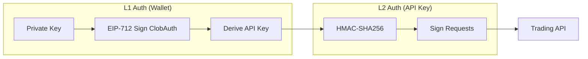

# Authentication Guide

This guide explains how authentication works in the Polymarket C++ SDK.

## Overview

Polymarket uses a two-tier authentication system:



## L1 Authentication (Wallet)

L1 authentication uses your Ethereum wallet to derive an API key. This is done once per session.

### Flow

1. Create a `ClobAuth` struct with your wallet address and timestamp
2. Sign it using EIP-712 typed data signing
3. Send to `/auth/derive-api-key` endpoint
4. Receive API key credentials

### Headers

| Header | Description |
|--------|-------------|
| `POLY_ADDRESS` | Your wallet address (checksummed) |
| `POLY_SIGNATURE` | EIP-712 signature of ClobAuth |
| `POLY_TIMESTAMP` | Unix timestamp (seconds) |
| `POLY_NONCE` | Nonce value (usually 0) |

### EIP-712 Domain

```cpp
struct EIP712Domain {
    std::string name = "ClobAuthDomain";
    std::string version = "1";
    uint64_t chainId = 137;  // Polygon mainnet
    Address verifyingContract;  // Zero address for auth
};
```

### ClobAuth Struct

```cpp
struct ClobAuth {
    Address address;  // Your wallet address
    std::string timestamp;  // Unix timestamp as string
    uint256_t nonce;  // Usually 0
    std::string message = "This message attests that I control the given wallet";
};
```

## L2 Authentication (API Key)

L2 authentication uses HMAC-SHA256 with your API key for fast request signing. Use this for all trading operations.

### Headers

| Header | Description |
|--------|-------------|
| `POLY_API_KEY` | Your API key |
| `POLY_PASSPHRASE` | Your passphrase |
| `POLY_SIGNATURE` | HMAC-SHA256 signature |
| `POLY_TIMESTAMP` | Unix timestamp (milliseconds) |

### Signature Calculation

```cpp
// 1. Create message to sign
std::string message = timestamp + method + path + body;

// 2. Sign with HMAC-SHA256 using API secret
auto signature = hmac_sha256(api_secret, message);

// 3. Encode as URL-safe base64
auto encoded = base64_encode(signature);
```

## Builder Program Authentication

If you're a registered builder, you can include additional headers for order attribution:

| Header | Description |
|--------|-------------|
| `POLY_BUILDER_API_KEY` | Your builder API key |
| `POLY_BUILDER_PASSPHRASE` | Builder passphrase |
| `POLY_BUILDER_SIGNATURE` | Builder signature |
| `POLY_BUILDER_TIMESTAMP` | Builder timestamp |

## Code Example

```cpp
#include <polymarket/clob/client.hpp>
#include <polymarket/crypto/secp256k1.hpp>

using namespace polymarket;
using namespace polymarket::clob;
using namespace polymarket::crypto;

int main() {
    // Load your private key (keep secure!)
    auto key = PrivateKey::from_hex("0x...");
    auto address = key->address();
    
    // Create client
    ClientConfig config;
    config.base_url = "https://clob.polymarket.com";
    config.chain_id = 137;
    
    auto client = Client::create(config);
    
    // Set signer for L1 auth
    client.set_signer(*address);
    
    // Derive API key (L1 auth)
    auto api_key = client.derive_api_key(*key);
    if (!api_key) {
        std::cerr << "Failed to derive API key: " 
                  << api_key.error().message() << std::endl;
        return 1;
    }
    
    // Set credentials for L2 auth
    client.set_api_credentials(*api_key);
    
    // Now you can trade!
    // All subsequent requests use L2 auth (faster)
    
    return 0;
}
```

## Security Best Practices

1. **Never hardcode private keys** - Use environment variables or secure vaults
2. **Use L2 auth for trading** - It's faster and doesn't expose your wallet signature
3. **Rotate API keys regularly** - You can create/delete API keys via the API
4. **Check timestamps** - Requests with stale timestamps will be rejected

## Signature Types

When placing orders, you must specify the signature type:

| Type | Value | Description |
|------|-------|-------------|
| EOA | 0 | Direct wallet signature |
| Proxy | 1 | Proxy/smart wallet |
| GnosisSafe | 2 | Gnosis Safe multisig |

For most users, use `SignatureType::EOA`.
