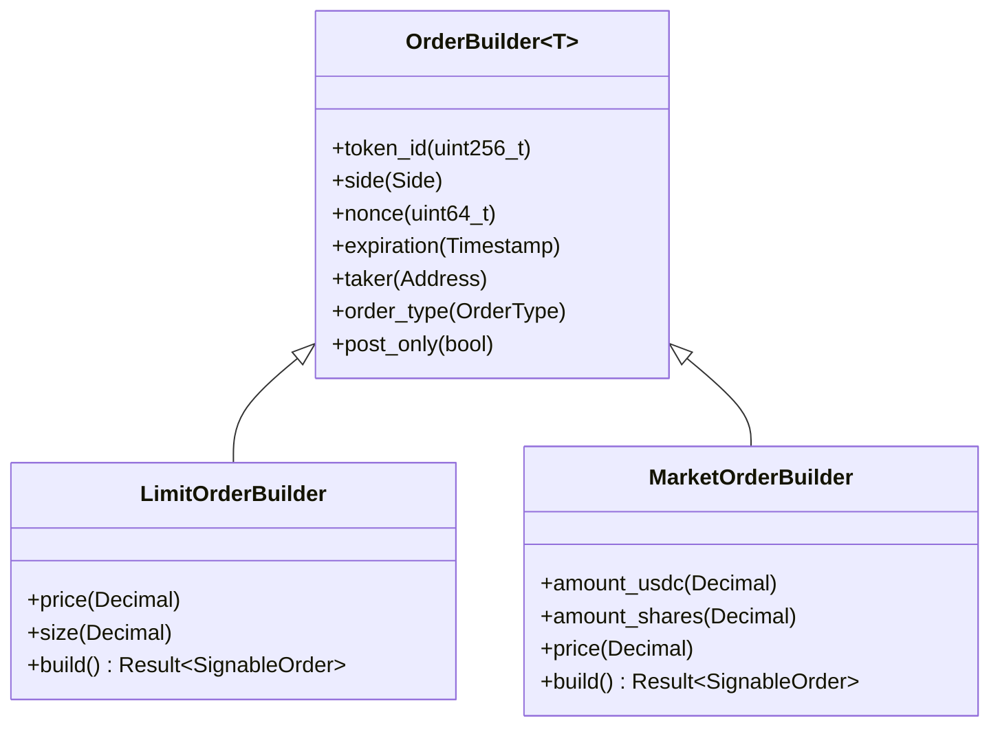
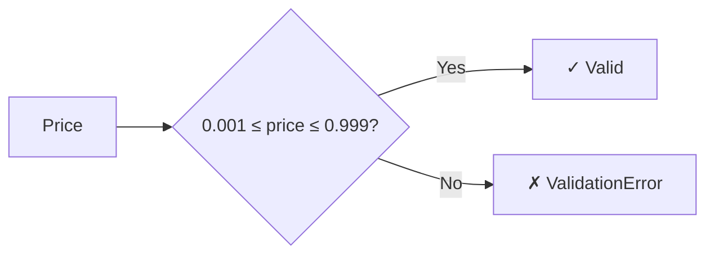
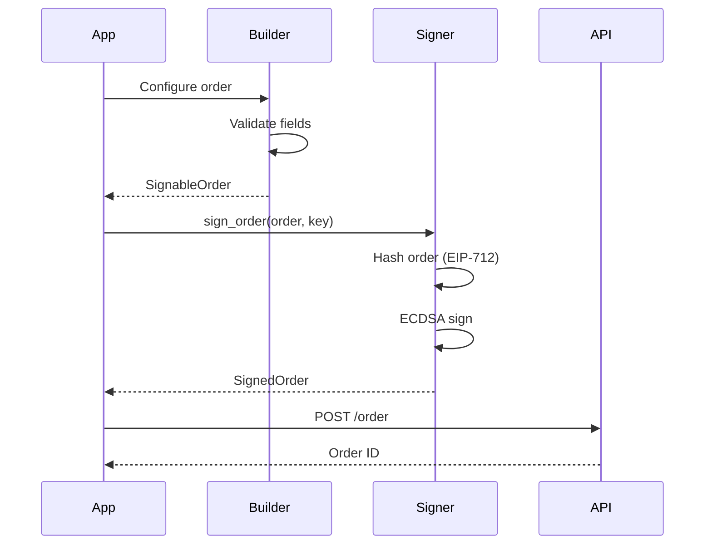

# Order Building Guide

This guide explains how to build orders using the polymarket-cpp SDK.

## Overview

The SDK provides type-safe order builders that validate orders at compile time and build time:



## Limit Orders

Limit orders specify both price and size:

```cpp
#include <polymarket/clob/client.hpp>

using namespace polymarket;
using namespace polymarket::clob;

// Get a builder from the client
auto builder = client.limit_order_builder();

// Configure the order
builder.token_id(uint256_t::from_string("12345"));
builder.side(Side::Buy);
builder.price(Decimal("0.65"));  // Buy at $0.65
builder.size(Decimal("100"));   // 100 shares

// Build and validate
auto order = builder.build();
if (!order) {
    std::cerr << "Error: " << order.error().message() << std::endl;
    return;
}

// Sign and submit
auto signed_order = client.sign_order(*order, key);
auto result = client.post_order(*signed_order);
```

### Price Validation

Prices must be between 0.001 and 0.999:



### Tick Size

The tick size determines price precision:

| Tick Size | Minimum Increment | Example Prices |
|-----------|------------------|----------------|
| Hundredth | 0.01 | 0.50, 0.51, 0.52 |
| Tenth | 0.1 | 0.5, 0.6, 0.7 |
| Thousandth | 0.001 | 0.500, 0.501, 0.502 |

## Market Orders

Market orders execute immediately at the best available price:

```cpp
auto builder = client.market_order_builder();

builder.token_id(token_id);
builder.side(Side::Buy);
builder.amount_usdc(Decimal("50"));  // Spend $50 USDC

auto order = builder.build();
```

### Amount Types

Market orders can specify amount in two ways:

1. **USDC Amount**: How much to spend (for buys) or receive (for sells)
2. **Shares Amount**: How many shares to buy or sell

```cpp
// Buy $100 worth of shares
builder.amount_usdc(Decimal("100"));

// OR buy exactly 200 shares
builder.amount_shares(Decimal("200"));
```

## Order Types

| Type | Description | Use Case |
|------|-------------|----------|
| GTC | Good Till Cancelled | Standard limit orders |
| GTD | Good Till Date | Orders with expiration |
| FOK | Fill or Kill | Must fill completely or not at all |
| FAK | Fill and Kill | Fill what you can, cancel rest (default for market) |

```cpp
builder.order_type(OrderType::GTD);
builder.expiration(Timestamp::from_unix(1735689600));  // Expire at this time
```

## Post-Only Orders

Post-only orders will be rejected if they would immediately match:

```cpp
builder.post_only(true);
```

This is useful for:
- Ensuring you receive maker rebates
- Avoiding unexpected fills

## Salt Generation

Every order needs a unique salt. The SDK generates one automatically, but you can set it:

```cpp
builder.nonce(12345);  // Custom nonce
```

Salt values are masked to ≤ 2^53 - 1 for JSON number safety.

## Order Signing Flow



## Error Handling

The builder returns `Result<SignableOrder>` which may contain errors:

```cpp
auto order = builder.build();
if (!order) {
    switch (order.error().code()) {
        case ErrorCode::ValidationError:
            // Missing or invalid field
            std::cerr << "Validation: " << order.error().message() << std::endl;
            break;
        default:
            std::cerr << "Error: " << order.error().message() << std::endl;
    }
}
```

### Common Validation Errors

| Error | Cause |
|-------|-------|
| "token_id is required" | Missing token ID |
| "side is required" | Missing buy/sell side |
| "price is required" | Missing price (limit orders) |
| "size is required" | Missing size (limit orders) |
| "price out of range" | Price not in 0.001-0.999 |
| "amount is required" | Missing amount (market orders) |

## Neg-Risk Markets

Some markets use "negative risk" pricing. The SDK handles this automatically, but you can check:

```cpp
auto neg_risk = client.get_neg_risk(token_id);
if (neg_risk && *neg_risk) {
    // This is a neg-risk market
    // The SDK will use the correct exchange address
}
```

## Best Practices

1. **Always validate before signing**: Check the `Result` from `build()`
2. **Use appropriate tick size**: Match the market's tick size
3. **Handle errors gracefully**: Network issues can occur
4. **Use post-only for maker strategies**: Avoid unexpected taker fees
5. **Set reasonable expirations**: GTD orders should have sensible deadlines
